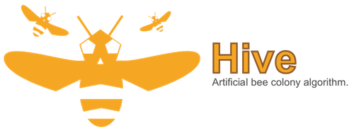

	

🍯**Hive** is a a swarm-based optimisation algorithm based on the intelligent foraging behaviour of honey bees. **Hive** implements the so-called **Artificial Bee Colony (ABC)** algorithm which is a swarm-based algorithms inspired by nature. Swarm intelligence refers to the collective behaviour of de-centralized, self-organized systems. The Artificial Bee Colony (ABC) was first proposed by Karaboga in 2005 (see **ref. ➀**). The overarching advantage of this algorithm is its relatively good balance between *exploration* and *exploitation*. In other words, exploitation, by definition, exploits known solution to minimize a cost function while exploration finds new solutions within un-explored parts of the search domain.

**Furthermore, the algorithm is pretty simple to use as it has almost no parameters to tune.**

This module is not implemented with **speed** in mind but, instead, it is a straightforward implementation of the underlying algorithm. If you have any suggestions for speed/feature improvements, do not hesitate to let me know!

### Intuition
----

In **Hive**, a swarm of artificial honey bees is made up of three types of individuals: employees, onlookers and scouts. The __Employed Bees (EB)__ and __Onlooker Bees (OB)__ exploit the nectar sources around the bee hive - i.e. this corresponds to the exploitation phase - while the **Scout Bees (SB)** explore the solution domain - i.e. this is the exploration phase.

The number of nectar sources (i.e. solution vectors) around the hive is equal to the number of actively employed bees and the number of employees is equal to the number of onlooker bees.  EBs go to their nectar source and return to the hive to recruit onlooker bees via the honey bee waggle dance (i.e. figure-eight dance). The number of dance repetitions the worker performs is dependent on the quality of the food source. Workers that found poor nectar sources stop dancing sooner and are thus less likely to be followed by onlooker bees. After depletion of a given nectar source, an employed bee abandons its food source and becomes a Scout Bee (SB). A scout bee starts to randomly search around the hive to find a new nectar source around it.

### Algorithm
------

As suggested in the previous summary of the algorithm, the ABC model of **Hive** consists of four phases that are accomplished sequentially, namely

➊ An **Initialisation Phase** where an initial population of bees is created to cover the entire search space as much as possible by uniformly randomizing the solution vector of individuals,

➋ An **Exploitation Phase** where new candidate solutions are generated for each employed bee using a cross-over and mutation operator. If the modified solution vector of a mutant bee is better than that of the original one, the new vector is assigned to the employed bee,

➌ A **Refinement Phase** during which onlooker bees attempt to locally improve the solution vectors of the employed bee they have decided to follow after the waggle dance phase. If they improve it, they will communicate their findings to the bee they initially watched waggle dancing,  

➍ An **Exploration Phase** where scout bees are sent out to un-explored regions of the search domain.   

### Constraints *(Not yet implemented)*
-----

For constrained optimisation problems, a *tournament selection* is selected. The pair-wise comparison between two individuals is exploited to make sure that (**ref. ➁**):

➊ **when two feasible solutions are compared**, the one with better objective function value is chosen,

➋ **when one feasible and one infeasible solutions are compared**, the feasible solution is chosen,

➌ **when two infeasible solutions are compared**, the one with smaller constraint violation is chosen.      

### Reference(s)
-----

➀ Karaboga, D. (2005), ""An Idea Based on Honey Bee Swarm for Numerical Optimization," _Technical Report-TR06_, Department of Computer Engineering, Engineering Faculty, Erciyes University, Turkey.

➁ Deb, K. (2000), "An efficient constraint handling method for genetic algorithms," _Computer Methods in Applied Mechanics and Engineering_, 186(2- 4):311–338, Elsevier, Netherlands.

### Citation
-----

@article{Hive2017,
    author = "Romain Wuilbercq",
    year = 2017,
    title = "Hive, an Artificial Bee Colony Optimization in Python",
    doi = {10.5281/zenodo.1004592},
    url = {https://doi.org/10.5281/zenodo.1004592}
}

### License
-----------

#### The MIT License (MIT)

Copyright (C) 2017 Romain Wuilbercq

Permission is hereby granted, free of charge, to any person obtaining a copy
of this software and associated documentation files (the "Software"), to deal
in the Software without restriction, including without limitation the rights
to use, copy, modify, merge, publish, distribute, sublicense, and/or sell
copies of the Software, and to permit persons to whom the Software is
furnished to do so, subject to the following conditions:

The above copyright notice and this permission notice shall be included in all
copies or substantial portions of the Software.

THE SOFTWARE IS PROVIDED "AS IS", WITHOUT WARRANTY OF ANY KIND, EXPRESS OR
IMPLIED, INCLUDING BUT NOT LIMITED TO THE WARRANTIES OF MERCHANTABILITY,
FITNESS FOR A PARTICULAR PURPOSE AND NONINFRINGEMENT. IN NO EVENT SHALL THE
AUTHORS OR COPYRIGHT HOLDERS BE LIABLE FOR ANY CLAIM, DAMAGES OR OTHER
LIABILITY, WHETHER IN AN ACTION OF CONTRACT, TORT OR OTHERWISE, ARISING FROM,
OUT OF OR IN CONNECTION WITH THE SOFTWARE OR THE USE OR OTHER DEALINGS IN THE
SOFTWARE.
